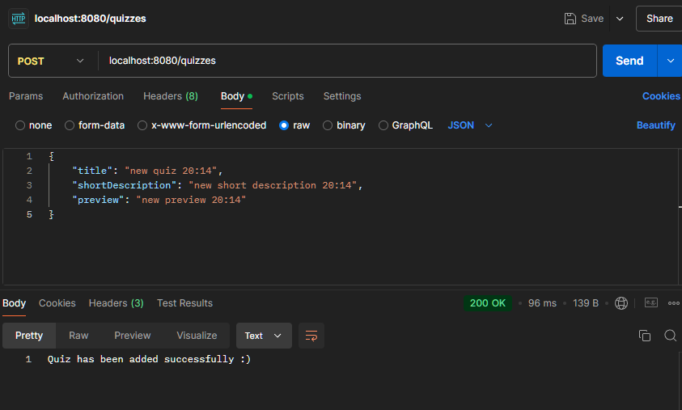
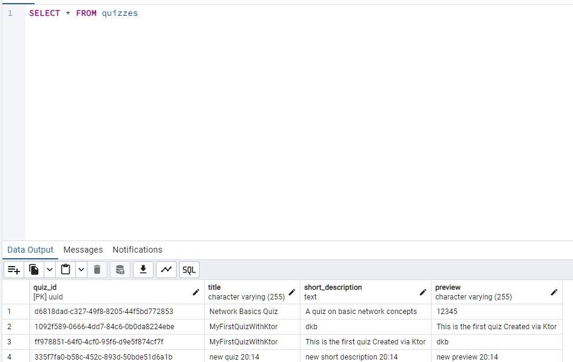

# Quizzes App Back-End Side

This project is a **Quiz and Question Management System** built using **Ktor** as the backend framework and **Exposed ORM** for database interactions. The system provides **RESTful API** endpoints to manage quizzes, questions, and their respective answer variants. The client side of the application can **create**, **update**, **delete**, and **retrieve** quizzes, questions, and answer variants.

## Demo

  
  

## Features

- **Quiz Management**: The client can perform CRUD operations on quizzes. Quizzes consist of a title, a short description, and an optional preview image. Each quiz is uniquely identified by a UUID (`quizId`).
- **Question Management**: For each quiz, the client can add multiple questions. Each question can have an optional explanation. Like quizzes, each question is uniquely identified by a UUID (`questionId`).
- **Answer Variant Management**: Each question can have multiple answer variants, where each variant contains the answer text and a flag indicating whether it is the correct answer. Each answer variant is uniquely identified by a UUID (`answerId`).
- **REST API**: The API is structured with clear REST principles, providing endpoints for creating, updating, retrieving, and deleting data. Each resource (quiz, question, answer variant) has dedicated endpoints for interacting with it.
- **UUID-Based Entities**: Quizzes, questions, and answer variants use auto-generated UUID values as their primary identifiers. This ensures that each entity is uniquely identifiable in the system.
- **Exposed ORM**: The system uses **Exposed** for database operations, allowing seamless interaction with the database through Kotlin code. Insertions, updates, and deletions are all handled via the `dbQuery` function, ensuring consistent database interaction.

## Technology Stack

- **Backend Framework**:  
 (Kotlin-based backend framework)
- **Database ORM**:  
 (Kotlin ORM library for relational database management)
- **Database**:  

- **Language**:  

## RESTful Endpoints

- Quizzes:
  - `GET /quizzes`: Retrieve all quizzes.
  - `GET /quizzes/{quizId}`: Retrieve a specific quiz by its `quizId`.
  - `POST /quizzes`: Create a new quiz.
  - `PUT /quizzes`: Update an existing quiz.
  - `DELETE /quizzes/{quizId}`: Delete a quiz by its `quizId`.

- Questions:
  - `GET /quizzes/{quizId}/questions`: Retrieve all questions for a specific quiz.
  - `GET /questions/{questionId}`: Retrieve a specific question by its `questionId`.
  - `POST /questions`: Create a new question for a specific quiz.
  - `PUT /questions`: Update an existing question.
  - `DELETE /questions/{questionId}`: Delete a question by its `questionId`.

- Answer Variants:
  - `GET /questions/{questionId}/answerVariants`: Retrieve all answer variants for a specific question.
  - `GET /answerVariants/{answerId}`: Retrieve a specific answer variant by its `answerId`.
  - `POST /answerVariant`: Create a new answer variant for a specific question.
  - `PUT /answerVariant`: Update an existing answer variant.
  - `DELETE /answerVariant/{answerId}`: Delete an answer variant by its `answerId`.

## Summary

This project is designed to **manage quiz content** efficiently through a clean **API structure** with distinct entities and operations for **quizzes**, **questions**, and **answer variants**. The system is flexible enough to support various **CRUD operations**, making it suitable for applications that require customizable quizzes and question management functionality.
